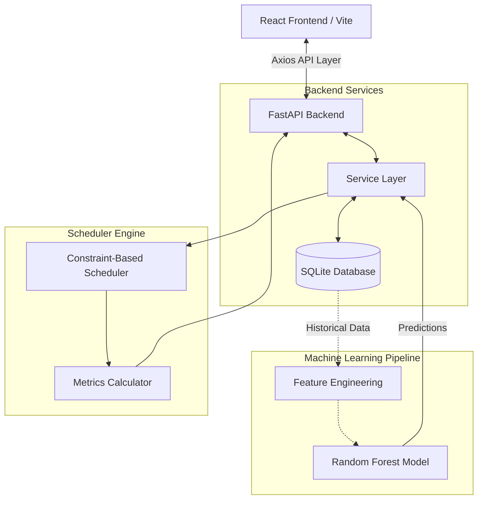

# Architecture Overview

## Technology Stack
- **Frontend**: React 18, Vite, TailwindCSS, Recharts, React-i18next
- **Backend**: FastAPI, Python 3.11, Pydantic, SQLAlchemy
- **Database**: SQLite (local embedded)
- **Machine Learning**: Scikit-Learn (Random Forest Regressor), Pandas, Joblib

## Data Flow

## Component Roles
1. **React Frontend**: Manages application state, handles English/Tamil internationalization, and visualizes scheduler performance via Recharts. 
2. **FastAPI Backend**: Exposes strongly-typed JSON endpoints for load management, simulation runs, and ML triggering. 
3. **ML Pipeline**: A vectorized Random Forest engine that ingests historical weather/generation data and outputs 24-hour predictive vectors with confidence scores.
4. **Scheduler Engine**: Evaluates constraints (essential load protection, deadlines, battery SOC) and scores time slots based on renewable surplus to output an optimal schedule.
